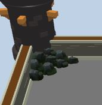
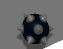
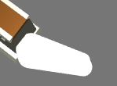
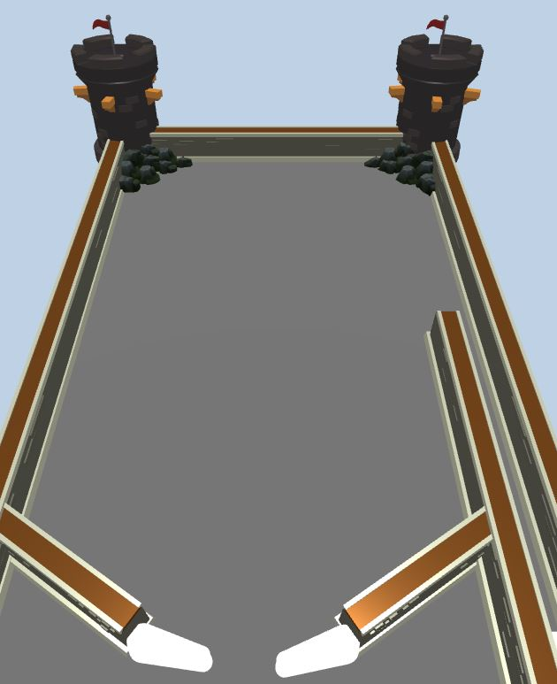

# Índice

1. Introducción
2. Arquitectura
3. Animacion
4. Físicas
5. Graficos


# 1. Introducción

El objetivo del proyecto ha sido recrear la base de el juego "Pinball" utilizando "ammo.js" y por otro lado en vez de utilizar tween.js hago uso de gsap.js.

# 2. Arquitectura
La estructura del proyecto se basa en el uso de tres partes principales:

1. **Three.js** — Gestiona todo lo visual: escena, cámara, luces, modelos y geometrías.  
2. **Ammo.js** — Gestiona las físicas: colisiones, gravedad, rigid bodies y simulación.
3. **gsap.js** — Gestiona las animaciones de el plunger y los flippers.

## 2.1 Integración Three.js + Ammo.js

- Three crea los objetos gráficos.  
- Ammo crea los cuerpos físicos equivalentes.  
- Cada objeto tiene su mesh (Three) y su rigid body (Ammo).  
- Un bucle (`updatePhysics`) actualiza el estado físico y lo sincroniza con la escena.

## 2.2 Estructura del Proyecto

- **index.js** conecta todo y gestiona el loop.  
- **graphics.js** crea lo que se ve.  
- **physics.js** crea las colisiones.  
- **flippers.js** y **plunger.js** manejan interacción del jugador.  
- **utility.js** funciones de ayuda para mantener el proyecto mas modular.

# 3. Animación

La animación en el proyecto se realiza principalmente con **gsap.js**, que permite mover elementos del pinball de forma suave sin bloquear el bucle principal.  
En vez de usar **Tween** hago uso de **gsap** debido a que este último tiene un bucle interno de animación a diferencia del otro.  
Se utiliza para los elementos que requieren movimientos controlados, como los **flippers** y el **plunger**.

---

## Flippers

Los flippers funcionan rotando alrededor de un punto fijo.  
GSAP se encarga de animar la **rotación del mesh** de manera fluida:

```js
gsap.to(flipper.rotation, {
  z: targetAngle,
  duration: 0.1,
  ease: "power1.out"
})
```
Después de cambiar la rotación del mesh, se sincroniza el **rigid body** de Ammo.js para que la física coincida con la animación visual.  
Esto asegura que la pelota reaccione correctamente al flipper, manteniendo la coherencia entre la animación y la simulación física.

---

## Plunger

El plunger es el mecanismo que lanza la pelota.  
Se anima con GSAP ajustando su posición a lo largo del eje vertical:

```js
gsap.to(plunger.position, {
  y: pullDistance,
  duration: 0.3,
  ease: "power2.inOut",
  onComplete: () => launchBall()
});
```
Cuando termina la animación, se aplica una fuerza al rigid body de la pelota para lanzarla, combinando animación y física de manera sincronizada.


# 4. Físicas

El motor de físicas simula la gravedad, las colisiones y el movimiento de los objetos en el tablero usando **Ammo.js**.

## Cuerpos Estáticos

Son objetos que no se mueven, como paredes o el suelo del tablero. Sirven para que la pelota rebote y se mantenga dentro del juego.

---

## Cuerpos Dinámicos

Son objetos que se mueven y reaccionan a fuerzas, como la pelota o los flippers. Interactúan con los cuerpos estáticos y otros objetos dinámicos.

---

# 5. Gráficos

La parte visual del proyecto se encarga de crear el tablero, las pelotas y todos los elementos que el jugador ve en pantalla.

---

## Tablero

El tablero se construye combinando varios modelos 3D:

- **Paredes:** se usan modelos de muralla para delimitar el área del juego y que la pelota rebote correctamente.  
- **Esquinas curvas:** se crean dos planos curvos, mediante la funcion createCurvedPlane(). Para que no se vean estos planos, hago que no sean visibles y simulo como si hubiesen unos escombros de piedra.  
  
---

## Pelotas

Las pelotas se representan con esferas 3D que se actualizan en cada frame según la posición del mundo físico. Uso un modelo 3D que simula una bola con pinchos de una típica maza medieval.  


---

## Flippers

Debido a que no he encontrado un modelo que me guste para los flippers, he usado uno que simplemente le da forma.

  


  


